🌐 <a href="README.md">中文</a> · <strong>English</strong> · <a href="README.ja.md">日本語</a>　|　Animated introduction above

<h2 align="center">🛠️ Tech Stack</h2>

	

	<code>Transformer</code> · <code>vLLM</code> · <code>LLM</code> · <code>KV Cache</code> · <code>FlashInfer</code> · <code>Quantization</code> · <code>CUDA Graph</code>

<h2 align="center">🚀 Products</h2>

	<strong>AI API Platform</strong> · <a href="https://icodeapi.com/">icodeapi.com</a>　<strong>Creator Platform</strong> · <a href="https://work.icodeapi.com/">work.icodeapi.com</a>　<strong>Blog</strong> · <a href="https://blog.lovecode.xin/">blog.lovecode.xin</a>

<h2 align="center">📫 Contact</h2>

	<a href="https://space.bilibili.com/635588114">Bilibili</a>　·　WeChat: <code>TryMyBest2Do</code>

---

**Model → Framework → Hardware → Optimization → Production**

