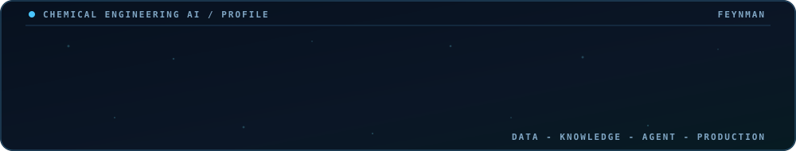

Feynman's GitHub Profile / English

<h1 align="center">Hi, I'm Feynman 馃憢</h1>

<h3 align="center">Chemical Engineering AI | LLM & Agent Systems | Intelligent Manufacturing</h3>

<a href="README.md">涓枃</a> 路 <strong>English</strong> 路 <a href="README.ja.md">鏃ユ湰瑾?/a>

---

## About Me

I am **Feynman**, focused on **chemical engineering intelligent systems**.

I work on bringing **AI, LLMs, agents, and industrial software engineering** into chemical and process manufacturing. My goal is to turn frontier model capabilities into deployable tools that connect industrial data, domain knowledge, workflows, and operational decisions.

## Current Focus

| Area | Questions I Care About |
| --- | --- |
| Chemical Process Intelligence | Process modeling, soft sensors, anomaly detection, predictive control, and optimization |
| Industrial LLMs | Chemical knowledge bases, industrial RAG, technical document understanding, and natural-language analytics |
| Agent Systems | Tool calling, multi-agent collaboration, workflow orchestration, memory, and audit trails |
| Intelligent Manufacturing | MES / DCS / SCADA integration, asset maintenance, quality management, and decision support |
| AI Engineering | Python, FastAPI, Docker, databases, model serving, and reproducible experiments |

## Selected Projects

### Chemical Process Copilot

An industrial knowledge and data assistant for process engineers, supporting document retrieval, operational data analysis, anomaly investigation, and standardized reports.

`Python` `LLM` `RAG` `Tool Calling` `Process Knowledge`

### Plant Agent System

A multi-agent workflow connecting production, quality, maintenance, and safety tasks with planning, tool execution, validation, and traceable results.

`Agent` `MCP` `Workflow` `Audit Log` `Industrial AI`

### Process Intelligence Platform

An engineering foundation for process manufacturing, covering data ingestion, feature construction, model serving, monitoring, prediction, and optimization.

`PyTorch` `FastAPI` `Time Series` `Docker` `MLOps`

## Tech Stack

**AI & Models:** LLMs, RAG, agents, transformers, PyTorch, time-series modeling, anomaly detection, predictive optimization
**Industrial Systems:** chemical processes, process manufacturing, MES / DCS / SCADA, industrial data, asset maintenance
**Engineering:** Python, FastAPI, Docker, PostgreSQL, Linux, Git, model serving, and reproducible research

---

<b>From industrial data to intelligent decisions, building AI systems that work in production.</b>

